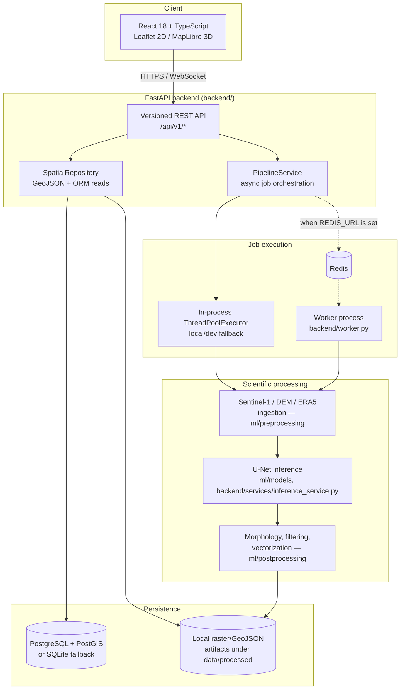

<div align="center">

# AvalancheVision

**[🔴 Live Demo / App Link](http://localhost:8085)**

**Physics-informed, multimodal satellite avalanche debris detection and mapping platform**

Sentinel-1 C-band SAR · Copernicus DEM terrain metrics · ECMWF ERA5-Land weather context · 10-band U-Net segmentation

[](https://github.com/helloAi0/AvalancheVision/actions/workflows/ci.yml)
[](LICENSE)
[](requirements.txt)
[](frontend/package.json)
[](backend/main.py)
[](frontend/package.json)

[Overview](#overview) · [Architecture](#architecture) · [Getting Started](#getting-started) · [Configuration](#configuration) · [API Reference](#api-reference) · [Development Workflow](#development-workflow) · [Deployment](#deployment) · [Project Status](#project-status--known-limitations) · [Contributing](#contributing)

</div>

---

## Overview

AvalancheVision maps avalanche debris deposits by fusing three independent satellite/weather data sources into a single scientific pipeline:

| Signal | Source | What it contributes |
|---|---|---|
| **SAR backscatter change** | Sentinel-1 C-band (pre/post-event pair) | Detects surface disturbance characteristic of avalanche debris |
| **Terrain** | Copernicus DEM GLO-30 | Slope, aspect, elevation — used both as model input and as a physics-based plausibility filter |
| **Weather** | ECMWF ERA5-Land | Precipitation, temperature, and snow-depth context around the event window |

These are stacked into a 10-band raster and passed through a PyTorch U-Net to produce a per-pixel avalanche-deposit probability map, which is then thresholded, morphologically filtered, and vectorized into GeoJSON polygons with zonal statistics (area, mean slope, mean elevation, aspect) for inspection on an interactive map.

The system is a **FastAPI backend + React/TypeScript frontend**, backed by PostgreSQL/PostGIS (or SQLite for local development), with an asynchronous job pipeline for running the detection workflow end to end.

> **Maturity note:** this is an active research/engineering project, not a finished production system. The [Project Status](#project-status--known-limitations) section below is intentionally explicit about what is fully working today versus what is scaffolding for planned work — please read it before deploying this anywhere that matters.

---

## Key Features

**Implemented and covered by tests**
- FastAPI backend with versioned REST API (`/api/v1/...`), request-ID correlation, structured error responses, and environment-driven CORS.
- Interactive 2D map (Leaflet) with detection overlays, AOI/footprint layers, basemap switching, and a coordinate HUD.
- Experimental 3D terrain workspace (MapLibre GL) with pitch/bearing controls and a click-to-draw transect tool.
- Controlled raster metadata/window API that reads Cloud-Optimized-GeoTIFF-validated rasters via Rasterio without ever exposing filesystem paths to the client.
- SQLAlchemy-backed job records with a stage-by-stage lifecycle (`QUEUED → RUNNING → COMPLETED/FAILED`) and per-job provenance events.
- Physics-informed post-processing: slope/aspect plausibility filtering and minimum-cluster-area filtering on top of raw model output.
- Zonal statistics extraction (area, elevation, slope, aspect) over vectorized detection polygons.
- CRS reprojection and Cloud-Optimized-GeoTIFF structural validation utilities.
- CI pipeline running the backend test suite and a frontend production build on every push/PR.

**Implemented but requiring configuration or infrastructure the repo doesn't provision for you**
- Sentinel-1 search/download via the Copernicus Data Space Ecosystem (requires your own CDSE credentials).
- SNAP GPT-based SAR preprocessing (requires a local ESA SNAP installation).
- PostGIS-backed persistence and Redis/Celery-based asynchronous job execution (see [Project Status](#project-status--known-limitations) for the current gap here).

**Planned / partially scaffolded** — see [`docs/AVALANCHEVISION_2_AUDIT.md`](docs/AVALANCHEVISION_2_AUDIT.md) for the full internal roadmap:
- Calibrated probability + epistemic uncertainty output (current output is raw sigmoid).
- Tile-server-backed (COG/TiTiler) raster delivery instead of whole-window PNGs.
- WebSocket-driven job status push in the UI (endpoint exists; frontend still polls).
- A consolidated "Mission Workspace" bringing map, transect, timeline, job state, and provenance into one view.

---

## Architecture



**Request flow for a detection job:**
`POST /api/v1/jobs/submit` → job record persisted (`QUEUED`) → executed by the thread-pool fallback or a queue worker → each pipeline stage (SAR ingestion → terrain extraction → ERA5 stacking → U-Net inference → physics filtering → vectorization) updates job progress and emits a provenance event → completed job's GeoJSON becomes queryable via `/api/v1/detections/geojson` and inspectable on the map.

---

## Tech Stack

| Layer | Technology |
|---|---|
| Backend framework | FastAPI, Uvicorn, Pydantic v2 |
| Backend language | Python 3.11 |
| ORM / migrations | SQLAlchemy 2.0 (sync + async engines) |
| Database | PostgreSQL 16 + PostGIS 3.4 (production), SQLite (local/dev, `USE_SQLITE=true`) |
| Async job queue | Redis 7 + a lightweight custom worker (`backend/worker.py`); a Celery app is also present (`backend/tasks/worker.py`) |
| Geospatial / raster | Rasterio, GDAL, Shapely, GeoPandas, PyProj |
| ML / inference | PyTorch, TorchVision, NumPy |
| Frontend framework | React 18, TypeScript, Vite |
| Mapping | Leaflet + react-leaflet (2D), MapLibre GL + react-map-gl (3D) |
| Charts | Recharts |
| Reverse proxy (Docker) | Nginx |
| Containerization | Docker, Docker Compose |
| CI | GitHub Actions |
| Testing | Pytest (backend), `tsc` + Vite build (frontend) |

---

## Repository Structure

```
AvalancheVision/
├── backend/                    FastAPI application
│   ├── main.py                 App factory: CORS, middleware, exception handling, lifespan
│   ├── worker.py                Redis-backed job worker (production async execution)
│   ├── api/
│   │   ├── router.py            Top-level API router
│   │   └── v1/                  Versioned route modules (health, jobs, detections, rasters,
│   │                             analysis, analytics, observations, models, export, provenance,
│   │                             terrain)
│   ├── core/                    Settings (Pydantic BaseSettings) and API-key security dependency
│   ├── repositories/            SQLAlchemy models, DB session factories, spatial repository
│   ├── schemas/                 Pydantic request/response schemas per domain
│   ├── services/                Domain services: pipeline, inference, detection, analytics,
│   │                             observation, export, provenance, terrain
│   └── tasks/                   Celery app + task definitions
├── frontend/                    React + TypeScript SPA
│   ├── src/
│   │   ├── pages/                Top-level pages (Mission Workspace, etc.)
│   │   ├── components/gis/       ScientificMap (2D), Map3DWorkspace (3D)
│   │   └── ...
│   └── vite.config.ts            Dev server + /api proxy configuration
├── ml/
│   ├── preprocessing/            Sentinel-1 ingestion, DEM pipeline, ERA5 stacking, feature stacking
│   ├── models/                   U-Net definition and training script
│   └── postprocessing/           Thresholding, morphology, vectorization, zonal-stat extraction
├── geospatial/                  CRS utilities, COG validation, raster contract validation, zonal stats
├── pipeline/                    Spatial processing orchestration helpers
├── orchestration/               Dagster asset definitions (optional orchestration layer)
├── visualization/               Standalone Folium map generation utility
├── database/
│   ├── init_schema.sql           Raw SQL bootstrap used by the Postgres container on first boot
│   └── migrations/                Versioned schema migration artifacts
├── docs/
│   └── AVALANCHEVISION_2_AUDIT.md Living architecture audit and migration roadmap
├── tests/                        Pytest suite (API, geospatial contract tests)
├── app.py                        Legacy standalone Streamlit/Folium prototype (not part of the
│                                  React/FastAPI runtime — kept for reference)
├── docker-compose.yml            Multi-service local/production stack definition
├── Dockerfile.backend / Dockerfile.frontend
├── nginx.conf                    Frontend container reverse-proxy config
├── requirements.txt              Backend Python dependencies
└── .github/workflows/ci.yml      CI pipeline definition
```

---

## Getting Started

### Prerequisites

| Tool | Version | Required for |
|---|---|---|
| Python | 3.11 | Backend |
| Node.js | 20.x | Frontend |
| Docker & Docker Compose | recent | Full-stack local run / deployment |
| PostgreSQL + PostGIS | 16 / 3.4 | Production-mode persistence (optional — SQLite works for local dev) |
| Redis | 7 | Queue-backed async job execution (optional — thread-pool fallback works without it) |

### Option A — Backend + frontend, run natively (fastest inner loop)

```bash
# 1. Clone
git clone https://github.com/helloAi0/AvalancheVision.git
cd AvalancheVision

# 2. Backend: create a virtualenv and install dependencies
python -m venv .venv
source .venv/bin/activate          # Windows: .venv\Scripts\activate
pip install -r requirements.txt

# 3. Configure environment (see the Configuration section below)
cp .env.example .env
# For a zero-dependency local run, set:
#   USE_SQLITE=true
# and leave REDIS_URL / CELERY_* empty (async jobs will run on an in-process
# thread pool instead of a queue — see Project Status for details).

# 4. Run the API
uvicorn backend.main:app --reload --port 8000
# API docs now available at http://127.0.0.1:8000/docs

# 5. In a second terminal, run the frontend
cd frontend
npm install
npm run dev
# App available at http://127.0.0.1:5173 (proxies /api to the backend automatically)
```

### Option B — Full stack via Docker Compose

```bash
git clone https://github.com/helloAi0/AvalancheVision.git
cd AvalancheVision
cp .env.example .env
# Set a real POSTGRES_PASSWORD in .env — compose will refuse to start without one.

docker compose up --build
```

This starts five services: `spatial-db` (PostGIS), `redis`, `backend` (FastAPI), `celery` (worker container), and `frontend` (Nginx serving the built SPA and reverse-proxying `/api` to the backend). The app is served at **http://localhost:8080**.

> ⚠️ Before relying on the `celery` service for real job execution, read the [Project Status](#project-status--known-limitations) section — the queue wiring between job submission and the worker container needs verification/fixing in your deployment before it can be trusted for anything beyond local experimentation.

### Verifying your setup

```bash
curl http://127.0.0.1:8000/api/v1/health
# {"status": "healthy" | "degraded", ...}
```

A `degraded` status with `database_status: UNAVAILABLE` means the API is up but can't reach its configured database — check your `.env`.

---

## Configuration

All configuration is environment-variable driven (`backend/core/config.py`, loaded via `pydantic-settings` from a `.env` file). Copy [`.env.example`](.env.example) to `.env` and adjust:

| Variable | Default | Purpose |
|---|---|---|
| `CDSE_CLIENT_ID` / `CDSE_CLIENT_SECRET` | *(empty)* | OAuth credentials for the Copernicus Data Space Ecosystem, needed to search/download real Sentinel-1 scenes. Register free at dataspace.copernicus.eu. |
| `DATA_RAW_DIR` | `data/raw` | Local landing zone for raw downloaded scenes. |
| `DATA_PROCESSED_DIR` | `data/processed` | Where generated rasters, GeoJSON, and per-job artifacts are written. |
| `FRONTEND_ORIGINS` | `http://localhost:5173,http://127.0.0.1:5173` | Comma-separated list of allowed CORS origins. |
| `USE_SQLITE` | `false` | Set `true` to use a local SQLite file instead of PostgreSQL — the fastest path for local development. |
| `API_KEY` | *(empty)* | When set, required as an `X-API-Key` header on expensive/mutating endpoints (job submission, raster windowing). Leave empty to disable auth (fine for local dev, **not** for any shared deployment). |
| `REDIS_URL` | *(empty)* | Redis connection string. When empty, job submission runs synchronously in-process via a thread pool. When set, jobs are pushed onto a Redis-backed queue for a worker process to pick up. |
| `CELERY_BROKER_URL` / `CELERY_RESULT_BACKEND` | *(empty, falls back to `REDIS_URL`)* | Celery broker/result-backend URLs, used by `backend/tasks/worker.py`. |
| `POSTGRES_USER` / `POSTGRES_PASSWORD` / `POSTGRES_DB` / `POSTGRES_HOST` / `POSTGRES_PORT` | see `.env.example` | PostgreSQL connection parameters. `POSTGRES_PASSWORD` is required (no default) when running via Docker Compose. |

**Frontend** configuration lives in `frontend/vite.config.ts` — the dev server proxies any `/api/*` request to `http://127.0.0.1:8000`, so the frontend itself needs no separate `.env` for local development.

---

## API Reference

Full interactive OpenAPI documentation is always available at **`/docs`** (Swagger UI) and **`/redoc`** once the backend is running. Summary of the versioned routes under `/api/v1`:

| Method | Path | Description |
|---|---|---|
| `GET` | `/health` | Liveness/readiness probe; reports real database connectivity. |
| `GET` | `/health/aoi` | Returns the currently configured area of interest. |
| `GET` | `/jobs` | List all processing jobs. |
| `GET` | `/jobs/{job_id}` | Get a single job's status, stages, and logs. |
| `POST` | `/jobs/submit` 🔒 | Submit a new detection pipeline run for an AOI/date pair. |
| `WS` | `/jobs/ws/{job_id}` | WebSocket stream of job status snapshots. |
| `GET` | `/detections/geojson` | Stream detections as a WGS84 GeoJSON `FeatureCollection`, with filtering. |
| `GET` | `/detections/{detection_id}` | Full detail (geometry, SAR/DEM/ERA5 telemetry) for one detection. |
| `GET` | `/detections/stats` | Aggregate summary statistics across current detections. |
| `GET` | `/detections/export` | Export detections in a downloadable format. |
| `GET` | `/rasters` | List metadata for all currently-available registered raster artifacts. |
| `GET` | `/rasters/{raster_id}` | Metadata (bounds, CRS, bands, COG status) for one raster, without exposing its filesystem path. |
| `GET` | `/rasters/window/{raster_id}` 🔒 | Bounded single-band PNG window of a raster, for map overlay rendering. |
| `POST` | `/analysis/profile` | Sample a registered raster's bands along a transect. |
| `POST` | `/terrain/profile` | Terrain elevation profile along a set of coordinates (used by the 3D transect tool). |
| `GET` | `/analytics/distributions` | Scientific analytics: confidence/slope/area distributions across detections. |
| `GET` | `/observations` | List available Sentinel-1 observation scenes. |
| `GET` | `/observations/pair` | Fetch a co-registered pre/post-event observation pair. |
| `GET` | `/models/current` | Metadata for the currently active model. |
| `GET` | `/models/registry` | Registry of available model versions. |
| `GET` | `/export/detections` \| `/export/report.pdf` \| `/export/geojson` \| `/export/csv` | Export endpoints in various formats. |
| `GET` | `/provenance/{job_id}` | Full lineage/provenance event trail for a job. |

🔒 = protected by `require_api_key` when `API_KEY` is configured.

---

## Development Workflow

### Running tests

```bash
# Backend — from repo root, with your virtualenv active
pytest tests -q

# Frontend — type-check and production build (this is what CI runs)
cd frontend
npm run build
```

The backend suite includes API contract tests (`tests/test_api.py`) and geospatial correctness tests (`tests/test_geospatial.py`, covering CRS reprojection and the 10-band model-stack contract). Tests that exercise the raster metadata/window/profile endpoints generate a small synthetic in-memory GeoTIFF via a `pytest` fixture (`tests/conftest.py`) rather than depending on real satellite data — this keeps the suite fully reproducible in CI without requiring multi-gigabyte fixtures to be committed to the repo.

### Continuous Integration

[`.github/workflows/ci.yml`](.github/workflows/ci.yml) runs on every push and pull request to `main`:

| Job | What it does |
|---|---|
| `backend-tests` | Installs `requirements.txt` + `pytest`, runs `pytest tests -q`. |
| `frontend-build` | Installs frontend dependencies, runs `npm run build` (TypeScript type-check + Vite production bundle). |

Both jobs must pass before merging. If you add a new endpoint or service that touches raster/GeoTIFF data, prefer extending the `synthetic_risk_raster`-style fixture pattern over adding real data files — anything under `data/`, `*.tif`, or similar is intentionally excluded from git (see `.gitignore`) to keep the repository lightweight.

### Branching & commits

- Branch from `main` using a descriptive prefix, e.g. `feature/transect-profile-ui`, `fix/raster-window-crs`, `docs/api-reference`.
- Keep commits scoped and use imperative, present-tense messages ("Fix raster window CRS mismatch", not "Fixed bug").
- Open a pull request against `main`; CI must be green before merge. Squash-merge is recommended to keep history readable.

### Code style

- **Python:** standard library type hints throughout; Pydantic models for all request/response boundaries. No enforced formatter is currently wired into CI — running `black`/`ruff` locally before committing is encouraged.
- **TypeScript:** strict mode is enabled in `frontend/tsconfig.json`; `npm run build` will fail the build on type errors, which is intentional and mirrors CI.

### Adding a new API endpoint

1. Define request/response schemas under `backend/schemas/`.
2. Implement the domain logic in a service under `backend/services/` (keep route handlers thin).
3. Add the route in the appropriate module under `backend/api/v1/`, and register the router in `backend/api/v1/router.py` if it's a new module.
4. Add a test in `tests/` exercising the new route via `fastapi.testclient.TestClient`.
5. If the endpoint reads raster data, follow the synthetic-fixture pattern in `tests/conftest.py` rather than depending on real data files.

---

## Deployment

The provided `docker-compose.yml` is a single-host deployment baseline:

| Service | Image / Build | Role |
|---|---|---|
| `spatial-db` | `postgis/postgis:16-3.4` | Primary datastore; bootstrapped from `database/init_schema.sql` on first start. |
| `redis` | `redis:7-alpine` | Queue backend for asynchronous job execution. |
| `backend` | `Dockerfile.backend` | FastAPI app, served by Uvicorn on port 8000 (internal only). |
| `celery` | `Dockerfile.backend` | Worker process for async pipeline execution. |
| `frontend` | `Dockerfile.frontend` | Nginx serving the built SPA and reverse-proxying `/api` (including the job-status WebSocket) to `backend`. Published on host port `8080`. |

**Before deploying to anything beyond your own machine:**
1. Set a strong, unique `POSTGRES_PASSWORD` in `.env` (Compose will refuse to start without one).
2. Set `API_KEY` to protect job submission and raster-window endpoints.
3. Restrict `FRONTEND_ORIGINS` to your real deployed frontend origin.
4. Verify the async job path end-to-end in your environment (submit a job, confirm it leaves `QUEUED`) — see the note in [Project Status](#project-status--known-limitations) below before assuming the `celery` container is actually consuming submitted jobs.
5. Put TLS termination in front of Nginx (a load balancer, Caddy, or a cloud provider's managed ingress) — the bundled `nginx.conf` serves plain HTTP only.

---

## Project Status & Known Limitations

This section exists so that anyone evaluating or deploying AvalancheVision has an accurate picture of what's solid versus what still needs work — a detailed, living version of this assessment is maintained in [`docs/AVALANCHEVISION_2_AUDIT.md`](docs/AVALANCHEVISION_2_AUDIT.md).

**Solid today**
- Core API surface, CRS handling, raster metadata/window serving, and the test suite are in good shape and covered by CI.
- The 2D map, filtering, and detection inspection flows work against real or synthetic data.

**Needs attention before production use**
- **Async job execution path.** `PipelineService.submit_job()` pushes queued jobs onto a Redis list; confirm whatever process consumes that queue in your deployment (`backend/worker.py`, or a properly wired Celery task) is actually the one running in your `celery` container before relying on it — a queue with no consumer will leave every submitted job stuck in `QUEUED`. Verify this with a real end-to-end submission after any deployment change to this area.
- **Concurrent job isolation.** Recent work moved per-job outputs (risk raster, output GeoJSON) into per-job artifact directories (`data/processed/jobs/{job_id}/`) to prevent concurrent runs from overwriting each other; the earlier shared-filename pattern is why this exists — keep new pipeline stages following the same per-job-path convention.
- **Scientific rigor.** Automated training labels are derived from signals that overlap with model inputs (leakage risk if used for evaluation); confidence scores are raw sigmoid output, not calibrated probability; there is no independent, versioned evaluation set yet.
- **Auth model.** `API_KEY` is a single shared secret with no per-user identity, rate limiting, or audit trail — adequate for a small trusted deployment, not for multi-tenant or public exposure.
- **Dependency completeness.** A few modules used for SAR/DEM ingestion and orchestration (`ml/preprocessing/*`, `orchestration/assets.py`, the legacy `app.py`) import packages not listed in `requirements.txt` (`requests`, `pystac-client`, `planetary-computer`, `dagster`, `streamlit`, `folium`). Install these separately if you're working in that part of the codebase, or add them to `requirements.txt` if you rely on it regularly.

**Planned** (see the audit doc for the full staged migration plan): calibrated uncertainty output, COG/tile-server raster delivery, durable event-sourced job state with real WebSocket push, and a consolidated Mission Workspace UI.

---

## Contributing

1. Fork the repository and clone your fork.
2. Create a feature branch (`git checkout -b feature/my-change`).
3. Make your change, following the [Development Workflow](#development-workflow) conventions above.
4. Run `pytest tests -q` and `npm run build` locally — both must pass.
5. Open a pull request against `main` with a clear description of the change and, for behavioral changes, how you verified it (a test, a manual repro, before/after output).
6. Be responsive to review — small, focused PRs get merged fastest.

Bug reports and feature requests are welcome via GitHub Issues. For anything touching scientific correctness (model inputs, physics filtering, zonal statistics), please include the reasoning/reference behind the change, not just the code.

---

## License

Released under the [MIT License](LICENSE).

---

## Acknowledgments

Built on top of open scientific and geospatial infrastructure: the [Copernicus Data Space Ecosystem](https://dataspace.copernicus.eu/) (Sentinel-1, Copernicus DEM), [ECMWF ERA5-Land](https://cds.climate.copernicus.eu/), [Rasterio](https://rasterio.readthedocs.io/)/GDAL, and the PyTorch ecosystem.