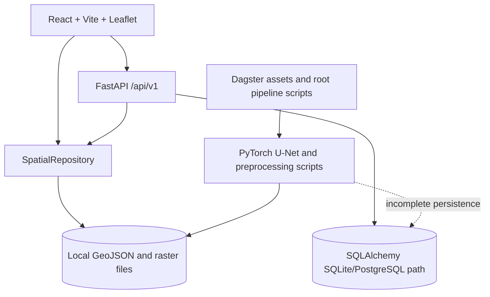
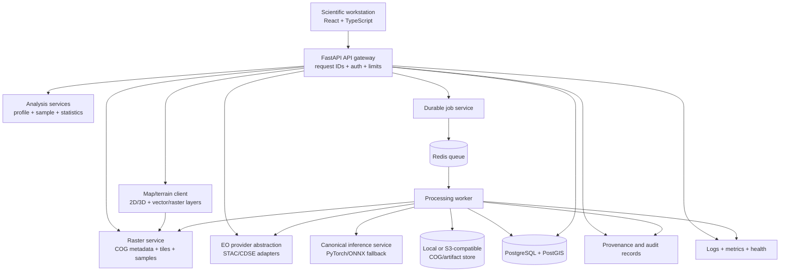

# AvalancheVision 2.0 Architecture Audit

Status: baseline audit completed 2026-09-04

This document records the current system state and the migration path toward a research-grade scientific geospatial workstation. It intentionally distinguishes implemented behavior from planned or simulated behavior.

## A. Current Architecture

### Runtime components

- Frontend: React 18, TypeScript, Vite, Leaflet, and `react-leaflet` under `frontend/`.
- API: FastAPI application factory in `backend/main.py`, with versioned routes aggregated by `backend/api/v1/router.py`.
- Services: detection, observation, analytics, export, inference, and pipeline services under `backend/services/`.
- Persistence: SQLAlchemy models in `backend/repositories/models.py`, database setup in `backend/repositories/database.py`, and a separate SQL bootstrap in `database/init_schema.sql`.
- Scientific processing: Sentinel-1, DEM, ERA5, feature stacking, U-Net, morphology, vectorization, and zonal statistics under `ml/`, `geospatial/`, `pipeline/`, and `visualization/`.
- Deployment: separate backend/frontend Dockerfiles, a PostGIS-only Compose file, and a basic GitHub Actions workflow.
- Legacy surface: `app.py` remains a separate Streamlit/Folium application and is not part of the React/FastAPI runtime.

## B. Current Capabilities

### Working or potentially working with prerequisites

- FastAPI health, detection, observation, analytics, model, job, and export routes.
- Leaflet map with basemap switching, detection GeoJSON, selection, filtering, AOI/footprint overlays, and coordinate HUD.
- Sentinel-1 CDSE authentication/search/download helpers when credentials and the external service are available.
- SNAP GPT SAR preprocessing when SNAP is installed and configured.
- Copernicus DEM STAC retrieval, reprojection, slope, and aspect generation.
- ERA5 NetCDF reading and feature enrichment.
- PyTorch U-Net training and inference for compatible 10-band input data.
- Raster thresholding, morphology, zonal statistics, reprojection, and GeoJSON vectorization.
- Basic model, analytics, observations, and processing-console pages.
- Local SQLite fallback and a PostGIS-oriented database design direction.

### Confirmed baseline

The current suite passes 5 tests:

- API health response.
- Detection GeoJSON shape.
- CRS reprojection.
- Physical slope filtering.
- Minimum-area geometry filtering.

The frontend production build also succeeds.

### AvalancheVision 2.0 work completed so far

- API CORS is environment-driven and restrictive for local browser clients.
- Responses include request correlation IDs and internal exception details are not returned to clients.
- Health diagnostics execute a real database connectivity query and report `DEGRADED` when the dependency is unavailable.
- Processing jobs are persisted through SQLAlchemy rather than an in-memory registry, and fabricated historical jobs were removed.
- A controlled `/api/v1/rasters` metadata API reads approved artifacts with Rasterio and never exposes filesystem paths.
- Processing lineage is persisted in `provenance_events`, exposed at `/api/v1/provenance/{job_id}`, and populated by real job lifecycle transitions.
- Job telemetry is available over `/api/v1/jobs/ws/{job_id}` from persisted snapshots, with terminal-state closure.
- The first explicit PostGIS migration artifact is stored under `database/migrations/`.
- The Mission Workspace consumes raster metadata/window APIs and renders CRS-correct raster overlays with scientific metadata and opacity controls.
- Observation sync has an explicit Copernicus STAC mode; offline/local inventory is labeled separately rather than presented as a live catalogue.
- COG-ready creation and structural validation utilities are implemented in `geospatial/cog.py`; full COG object-storage/TiTiler delivery remains pending.
- Optional constant-time API-key protection now covers expensive job submission and raster window operations when `API_KEY` is configured.
- Compose now defines a single-host deployment baseline with PostGIS, Redis, API, worker, frontend, health-gated startup, persistent volumes, and API/WebSocket proxying.
- The regression suite now contains 9 passing tests and the frontend production build remains green.

## C. Current Weaknesses

### Scientific and data integrity

- The observation catalogue is hard-coded to four Davos records in `backend/services/observation_service.py`.
- AOI bounds, scene information, dates, footprints, and regional defaults are repeated across backend, frontend, and processing code.
- The processing service accepts dates, AOI, model, and physics options but does not consistently use them.
- The 10-band contract is not enforced end to end. `ml/preprocessing/feature_stacking.py` and weather enrichment do not share a validated schema for names, units, CRS, nodata, dimensions, or acquisition alignment.
- Automated labels are derived from SAR and slope signals that overlap with model inputs, creating leakage risk if used for evaluation.
- Validation metrics in analytics/model responses are static and not tied to an independent versioned test set.
- Raw sigmoid output is presented as confidence; calibrated probability and epistemic uncertainty are not implemented.
- Provenance is mostly free-form GeoJSON properties rather than an immutable run manifest and lineage graph.

### Runtime and architecture

- Jobs live in an in-process dictionary and execute in a local `ThreadPoolExecutor`; restart loses state and multiple workers cannot share job state.
- Pipeline stages contain sleeps and status messages around only partial real processing. Concurrent jobs can overwrite shared output filenames.
- Detection and analytics reads primarily bypass the database and use cached local GeoJSON.
- SQLAlchemy models and `database/init_schema.sql` describe incompatible hazard-prediction schemas; no migrations exist.
- There is no COG validation, tile service, TileJSON, point sampling API, object-storage abstraction, or viewport-driven raster access.
- Inference reads the full feature stack into memory; the current sliding window is not truly out-of-core.
- Duplicate inference implementations can diverge in normalization and tiling behavior.

### Frontend and product UX

- The map is 2D Leaflet with hard-coded AOI and observation footprint overlays; there is no terrain-capable 3D engine.
- There is no synchronized SAR comparison, transect/profile tool, pixel inspector, temporal timeline, raster layer metadata/control surface, or uncertainty layer.
- Job monitoring polls every four seconds rather than consuming a real event stream.
- Pages contain fallback scientific values and metrics when API data is absent. These must be replaced with explicit unavailable/degraded states.
- The current shell is a good base but still reads as a dashboard rather than a mission analysis workspace.

### Security and operations

- CORS allows every origin with credentials enabled in `backend/main.py`.
- The global exception response exposes exception text and request paths.
- No authentication, authorization, rate limits, request quotas, upload constraints, or audit trail exists.
- Database credentials are present in Compose/config defaults and the database is published directly on host port 5432.
- The frontend tooltip interpolates server properties into HTML without escaping.
- Health reports database connectivity without performing an authoritative connectivity query.
- There are no structured request IDs, metrics, traces, readiness/liveness separation, backup policy, or artifact retention policy.

### Reproducibility and delivery

- Large data and model artifacts are ignored by Git, so a fresh checkout cannot reproduce the displayed state without a documented acquisition/bootstrap step.
- `requirements.txt` omits imported runtime packages such as `pystac-client`, `planetary-computer`, `requests`, Dagster, Streamlit, and Folium-related packages.
- Compose launches only PostGIS; backend, frontend, worker, queue, and raster delivery are not integrated.
- Tests do not cover ingestion, persistence, jobs, model compatibility, raster contracts, exports, security, or frontend workflows.

## D. Prioritized Upgrade Roadmap

### P0 — stability, correctness, and safety

1. Establish one authoritative persistence path for AOIs, observations, detections, jobs, artifacts, model versions, and provenance.
2. Reconcile ORM and SQL schemas; introduce migrations, constraints, spatial indexes, and transaction-safe repositories.
3. Replace fabricated production metrics, fallback scientific values, and seeded historical jobs with explicit provenance-backed records or unavailable states.
4. Make the pipeline durable and isolated: persisted state, retries, cancellation, idempotency, per-job artifact directories, and bounded concurrency.
5. Harden the API: restrictive CORS, secret-only configuration, safe error envelopes, request IDs, input validation, rate limits, and authorization boundaries.
6. Define independent evaluation data and remove leakage from reported model metrics.

### P1 — scientific platform foundations

1. Create a validated multimodal raster contract with band names, units, CRS, nodata, temporal alignment, checksums, and quality masks.
2. Integrate AOI creation, catalog search, observation pairing, processing, inference, vectorization, and persistence as one real workflow.
3. Add COG creation/validation, controlled raster metadata/statistics/sampling endpoints, and viewport-driven tile delivery.
4. Make inference chunked and batch-aware with overlap handling, bounded memory, geospatial preservation, and one canonical implementation.
5. Add probability calibration, uncertainty outputs, quality flags, and explicit model/inference metadata.
6. Implement WebSocket or SSE job events with polling fallback and persisted stage logs.
7. Build the Mission Workspace around map, layers, inspector, profile, timeline, processing state, and provenance.

### P2 — scale and operational maturity

1. Add a worker/queue architecture only after the durable job contract is defined; start with Redis plus a simple worker model unless measurements justify more.
2. Add object-storage-compatible artifact access with local filesystem development support.
3. Add structured logs, Prometheus-compatible metrics, readiness/liveness probes, audit events, retention, and backup/restore procedures.
4. Add API, database, geospatial, ML smoke, frontend, integration, and critical user-journey tests.
5. Pin and audit dependency trees; add CI lint/type/test/build/container checks and vulnerability scanning.

### P3 — analysis and polish

1. Evaluate MapLibre terrain, Cesium, or deck.gl against real raster/vector delivery benchmarks before selecting a 3D engine.
2. Add synchronized pre/post SAR comparison, transect profiles, temporal exploration, and pixel inspection using available data only.
3. Add report generation, GeoPackage/Parquet export, shareable analysis state, and richer model/experiment registry views.
4. Complete responsive, accessible, and visual quality passes with real screenshots and browser interaction checks.

## E. Target AvalancheVision 2.0 Architecture

### Boundary decisions

- Keep one deployable backend codebase initially. Split services only where workload or isolation requires it.
- Treat PostgreSQL/PostGIS as authoritative metadata and vector storage; keep large rasters and model artifacts in a storage abstraction.
- Treat COG/TiTiler-style delivery as a data-plane concern. The API controls access and metadata but does not return whole rasters.
- Treat jobs as durable domain records. Queue and worker technology are implementation details behind the job service.
- Treat model probability, calibrated probability, uncertainty, and quality flags as separate fields and visual encodings.
- Keep all external EO providers behind a provider interface so regional/catalog changes do not spread through the application.

## F. Migration Plan

### Stage 0 — baseline and contracts

- Freeze current working API shapes with characterization tests.
- Define `AOI`, `Observation`, `RasterArtifact`, `ProcessingJob`, `InferenceRun`, `Detection`, `ModelVersion`, and `ProvenanceEvent` contracts.
- Decide which existing local artifacts are fixtures, reproducible inputs, or disposable generated outputs.
- Add a data-quality status to every response that can be incomplete or unavailable.

### Stage 1 — persistence and security

- Add Alembic and migrate the schema from the ORM model, including PostGIS geometry and indexes.
- Route detection, observation, job, export, and analytics reads through repositories.
- Remove seeded jobs and hard-coded catalogue responses from production paths.
- Add safe configuration, restrictive CORS, request IDs, validation, and non-leaking error responses.

### Stage 2 — real processing workflow

- Persist AOIs and observation pairs.
- Add provider-backed search and explicit acquisition metadata.
- Make every processing stage consume the request contract and write isolated artifacts.
- Add input validation for CRS, shape, resolution, bands, nodata, temporal pairing, and overlap.
- Emit a run manifest containing source identifiers, checksums, software version, model hash, parameters, and timestamps.

### Stage 3 — raster and inference plane

- Build and validate COGs at ingestion/output boundaries.
- Add controlled metadata, TileJSON/tile, statistics, and point-sampling APIs.
- Implement windowed/batched inference and benchmark memory/latency against the current full-raster path.
- Add canonical normalization and model compatibility checks.

### Stage 4 — observable jobs

- Move execution behind a durable queue and worker.
- Persist stage transitions and structured logs.
- Add WebSocket/SSE events sourced from persisted state, not fabricated timers.
- Add retry, cancellation, idempotency, worker health, and artifact cleanup policies.

### Stage 5 — Mission Workspace

- Consolidate AOI, observations, map/layers, detection inspector, profile, timeline, job state, uncertainty, and provenance into one responsive workspace.
- Add 3D only after raster/vector delivery and camera performance are measured.
- Add synchronized SAR comparison and pixel/profile inspection using real endpoints.

### Stage 6 — scientific validation and production delivery

- Create scene/geography/season-separated evaluation datasets and publish metric manifests.
- Add calibration and uncertainty evaluation with limitations visible in the UI.
- Add integration/E2E tests for the analyst journey.
- Integrate Compose for local development and separate staging/production deployment manifests.
- Add backups, dependency/container scanning, release versioning, and operational runbooks.

## Definition of Done for the Transformation

AvalancheVision 2.0 is ready for a release candidate only when the critical analyst flow works with real or explicitly unavailable data:

`open -> select AOI -> search observations -> select pair -> stream raster -> run job -> observe persisted events -> inspect detection -> inspect probability and uncertainty -> draw profile -> trace provenance -> export`

Every displayed scientific value must have a source, unit, timestamp/version where applicable, and a truthful unavailable state when the source is missing. Performance claims must include the dataset, hardware, method, and before/after measurements.